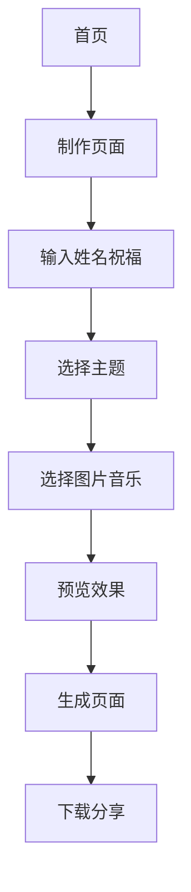

## 1. 产品概述
祝福视频生成器是一个简单易用的在线工具，帮助用户为亲人制作个性化祝福视频。用户只需输入姓名和祝福语，选择主题模板、图片和音乐，即可快速生成60-90秒的祝福视频并可下载分享。

## 2. 核心功能

### 2.2 功能模块
祝福视频生成器包含以下主要页面：
1. **首页**：产品介绍、开始制作按钮、模板预览。
2. **制作页面**：信息输入、主题选择、素材上传、视频预览。
3. **生成页面**：视频生成进度、预览播放、下载分享。

### 2.3 页面详情
| 页面名称 | 模块名称 | 功能描述 |
|---------|---------|---------|
| 首页 | 产品展示 | 展示祝福视频效果预览，吸引用户使用 |
| 首页 | 开始制作 | 引导用户进入制作流程 |
| 制作页面 | 基础信息 | 输入收祝福人姓名、编写祝福语 |
| 制作页面 | 主题选择 | 选择视频主题模板（生日、节日、日常等） |
| 制作页面 | 素材上传 | 上传个人照片或选择系统图片 |
| 制作页面 | 音乐选择 | 选择背景音乐或上传自定义音乐 |
| 制作页面 | 实时预览 | 实时显示视频效果预览 |
| 生成页面 | 视频生成 | 后台生成60-90秒祝福视频 |
| 生成页面 | 进度显示 | 显示视频生成进度百分比 |
| 生成页面 | 预览播放 | 播放生成的祝福视频 |
| 生成页面 | 下载分享 | 下载视频到本地或分享到社交平台 |

## 3. 核心流程
用户操作流程：
1. 用户进入首页，浏览产品介绍和模板预览
2. 点击开始制作，进入制作页面
3. 输入收祝福人姓名和编写祝福语
4. 选择视频主题模板
5. 上传照片或选择系统图片
6. 选择背景音乐
7. 实时预览视频效果
8. 确认无误后提交生成
9. 等待视频生成完成
10. 预览生成的祝福视频
11. 下载视频到本地或分享

## 4. 用户界面设计

### 4.1 设计风格
- 主色调：温暖粉色系（#FF6B9D）配白色背景
- 按钮样式：圆角设计，渐变色彩
- 字体：思源黑体，标题24px，正文16px
- 布局风格：卡片式布局，居中显示
- 图标风格：线性图标，简洁友好

### 4.2 页面设计概述
| 页面名称 | 模块名称 | UI元素 |
|---------|---------|--------|
| 首页 | 产品展示 | 全屏背景视频，居中标题，渐变按钮 |
| 制作页面 | 信息输入 | 圆角输入框，占位符文字，实时验证 |
| 制作页面 | 主题选择 | 网格布局主题卡片，悬停效果 |
| 制作页面 | 素材上传 | 拖拽上传区域，缩略图预览 |
| 生成页面 | 进度显示 | 圆形进度条，百分比数字 |
| 生成页面 | 视频预览 | 全屏播放，控制条，下载按钮 |

### 4.3 响应式设计
采用桌面端优先设计，适配移动端显示。触摸交互优化，支持手势操作。