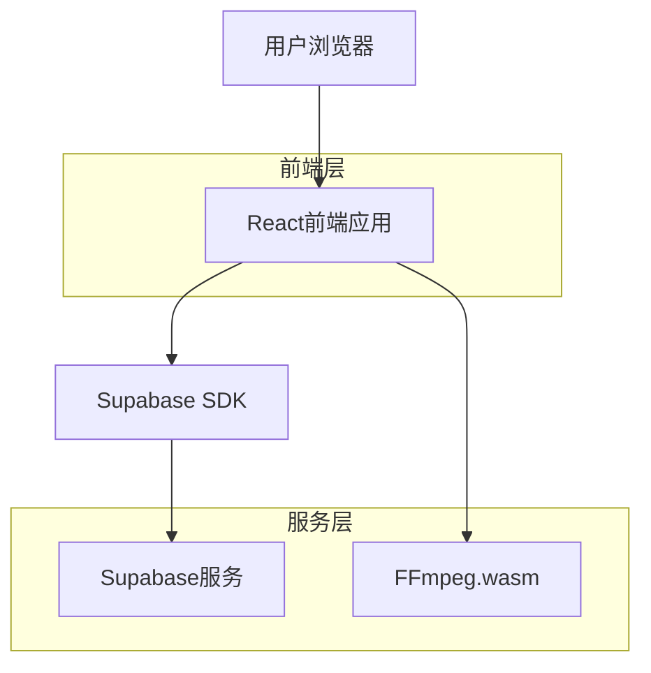
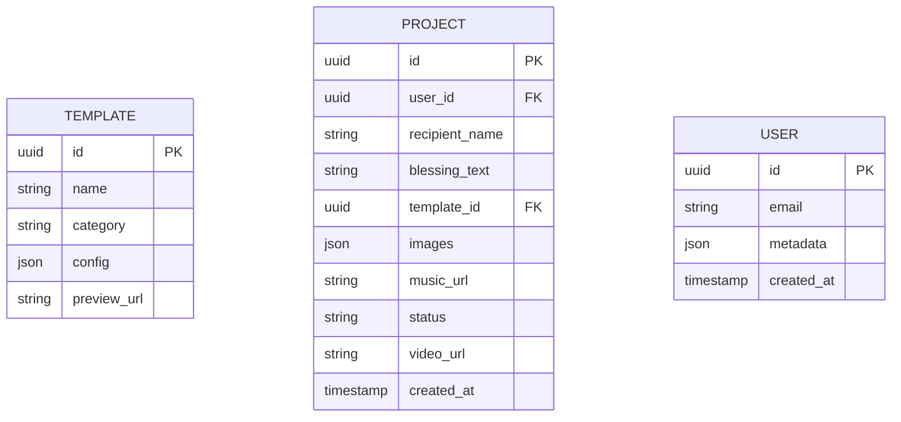

## 1. 架构设计



## 2. 技术描述

- 前端：React@18 + tailwindcss@3 + vite
- 初始化工具：vite-init
- 后端：Supabase（认证+存储）
- 视频处理：FFmpeg.wasm（浏览器端视频合成）
- 状态管理：React Context + useReducer

## 3. 路由定义

| 路由 | 用途 |
|------|------|
| / | 首页，产品介绍和模板展示 |
| /create | 制作页面，视频制作流程 |
| /preview | 预览页面，视频效果预览 |
| /download | 下载页面，生成和下载视频 |

## 4. 数据模型

### 4.1 数据模型定义



### 4.2 数据定义语言

模板表（templates）
```sql
-- 创建模板表
CREATE TABLE templates (
  id UUID PRIMARY KEY DEFAULT gen_random_uuid(),
  name VARCHAR(100) NOT NULL,
  category VARCHAR(50) NOT NULL,
  config JSONB NOT NULL,
  preview_url TEXT,
  created_at TIMESTAMP WITH TIME ZONE DEFAULT NOW()
);

-- 授权访问
GRANT SELECT ON templates TO anon;
GRANT ALL ON templates TO authenticated;
```

项目表（projects）
```sql
-- 创建项目表
CREATE TABLE projects (
  id UUID PRIMARY KEY DEFAULT gen_random_uuid(),
  user_id UUID REFERENCES auth.users(id),
  recipient_name VARCHAR(100) NOT NULL,
  blessing_text TEXT NOT NULL,
  template_id UUID REFERENCES templates(id),
  images JSONB DEFAULT '[]',
  music_url TEXT,
  status VARCHAR(20) DEFAULT 'draft' CHECK (status IN ('draft', 'processing', 'completed', 'failed')),
  video_url TEXT,
  created_at TIMESTAMP WITH TIME ZONE DEFAULT NOW(),
  updated_at TIMESTAMP WITH TIME ZONE DEFAULT NOW()
);

-- 创建索引
CREATE INDEX idx_projects_user_id ON projects(user_id);
CREATE INDEX idx_projects_status ON projects(status);
CREATE INDEX idx_projects_created_at ON projects(created_at DESC);

-- 授权访问
GRANT SELECT ON projects TO anon;
GRANT ALL ON projects TO authenticated;
```

### 4.3 存储策略

头像和图片存储桶（avatars）
```sql
-- 创建存储桶
INSERT INTO storage.buckets (id, name, public) VALUES ('avatars', 'avatars', true);

-- 设置访问策略
CREATE POLICY "头像公开可读" ON storage.objects FOR SELECT USING (bucket_id = 'avatars');
CREATE POLICY "用户可上传头像" ON storage.objects FOR INSERT WITH CHECK (bucket_id = 'avatars' AND auth.uid() = owner);
```

视频文件存储桶（videos）
```sql
-- 创建存储桶
INSERT INTO storage.buckets (id, name, public) VALUES ('videos', 'videos', true);

-- 设置访问策略
CREATE POLICY "视频公开可读" ON storage.objects FOR SELECT USING (bucket_id = 'videos');
CREATE POLICY "用户可上传视频" ON storage.objects FOR INSERT WITH CHECK (bucket_id = 'videos' AND auth.uid() = owner);
```